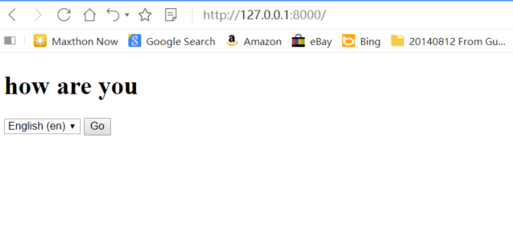
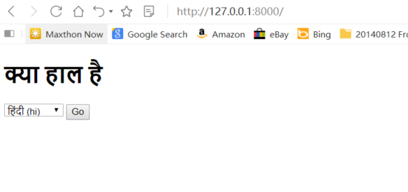
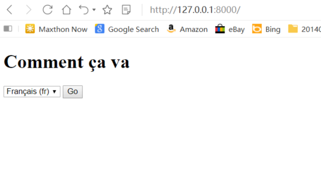

# Django internationalization :

 In computing, internationalization and localization or internationalisation and localisation are means of adapting computer software to different languages, regional peculiarities and technical requirements of a target locale. 
# What is Internationalization?
Internationalization is a design process that ensures a product (usually a software application) can be adapted to various languages and regions without requiring engineering changes to the source code. Think of internationalization as readiness for localization. Internationalization can save significant expense, time, and headaches for everyone involved. Sometimes written as "i18n", internationalization evolved from a growing demand for multilingual products and applications.

#### There are many benefits to i18n, including:

 > Easier adaptation of software applications (or other content) to multiple locales
Reduced time and cost for localization
Single, internationalized source code for all versions of the product
Simpler maintenance
Improved quality and code architecture
Reduced overall cost of ownership of the multiple versions of the product
Adherence to international standards
Some practical examples of how internationalization is critical to multilingual products include:
Independence from a specific language/character set encoding
Independence from specific cultural conventions
Removal of hard-coded text
Minimization of concatenated text strings
Careful use of in-line variables
Compatibility with third-party tools
Unicode compliance for global text display
Accommodation of double-byte languages (for example, Japanese)
Accommodation of right-to-left languages (for example, Arabic)

# Project Setup

  - Making the project as :
     ```
     mkdir django_internationalization_example
	    cd django_internationalization_example
    ```
  - Install Django:
    ```
    pip install django
    ```
  - Make apps (for class based views)
    ```
    django-admin startapp person_django_rest_swagger
    ```
 - Integrating internationalization_languages
    ```
    pip install internationalization_languages
    ```
 - Add 'internationalization_languages' apps to settings.py as:
    ```
    INSTALLED_APPS = [
				...
				'internationalization_languages',
	   ]
    ```
 - Add the Locale middleware in the correct position, to be able to determine the user’s language preferences through the request context:
     ```
    MIDDLEWARE_CLASSES = (
        ...
        'django.contrib.sessions.middleware.SessionMiddleware',
        'django.middleware.locale.LocaleMiddleware',
        'django.middleware.common.CommonMiddleware',
        ...
    )
    ```
    Next, specify the languages you want to use:
     ```
    from django.utils.translation import ugettext_lazy as _
    LANGUAGES = (
        ('en', _('English')),
        ('ca', _('Catalan')),
    )
   
    # Tell Django where the project's translation files should be.
    LOCALE_PATHS = (
        os.path.join(BASE_DIR, 'locale'),
    )
    ```

 - Make a view
     ``` 
   def home(request):
          return render(request, "index.html")
    ```
 - Create templates/index.html as follow : 
     ``` 
    <!DOCTYPE html>
    
    <html lang="en">
    <head>
        <meta charset="UTF-8">
        <title>Internationalization Languages and Time zones</title>
    </head>
    <body>
    
    <h1></h1>
    
    <form action="" method="post">
        
        <input name="next" type="hidden" value="{{ redirect_to }}" />
        <select name="language">
            
            
            
                <option value="{{ lang.0 }}"  selected="selected">
                    {{ lang.1 }} ({{ lang.0 }})
                </option>
            
        </select>
        <input type="submit" value="Go" />
    </form>
    </body>
    </html> 
     ``` 
 - Internationalization – Translation    
    * Finally, we are able to translate our strings!
    Go to the terminal
     ``` 
     python manage.py makemessages -l en
     python manage.py makemessages -l fr
     python manage.py makemessages -l hi
      ``` 
 - let Django generate all the needed files and folders  :  
    Django uses the GNU gettext format for storing translations. Gettext stores all the strings in a file and compiles this file to a binary. Gettext is also used by Wordpress. You can edit the gettext po files with any editor, but I prefer a program called Poedit.

 - open the django.po file with an editor    
     ``` 
     internationalization_languages/locale/en
        msgid "msg"
        msgstr "how are you"
    internationalization_languages/locale/fr
        msgid "msg"
        msgstr "Comment ça va"
    internationalization_languages/locale/hi
        msgid "msg"
        msgstr "क्या हाल है"
      ``` 
 - compile the po files    
    ```  
    django-admin compilemessages
    ``` 
    
 - In order to run the it apply migrations to make tables in db against models and runserver to test:
      ```
	  python manage.py runserver
      ```

 - python manage.py runserver
    * Your should run at: http://127.0.0.1:8000/

  ### Output like this :
   
   
   
    
   